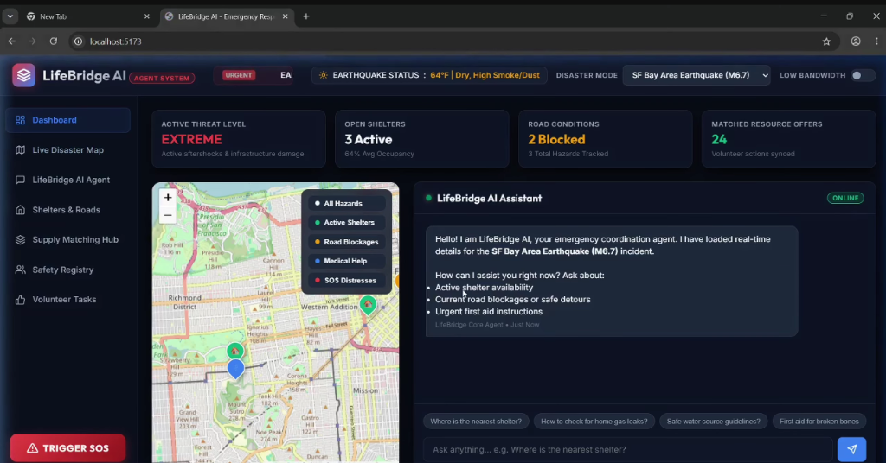
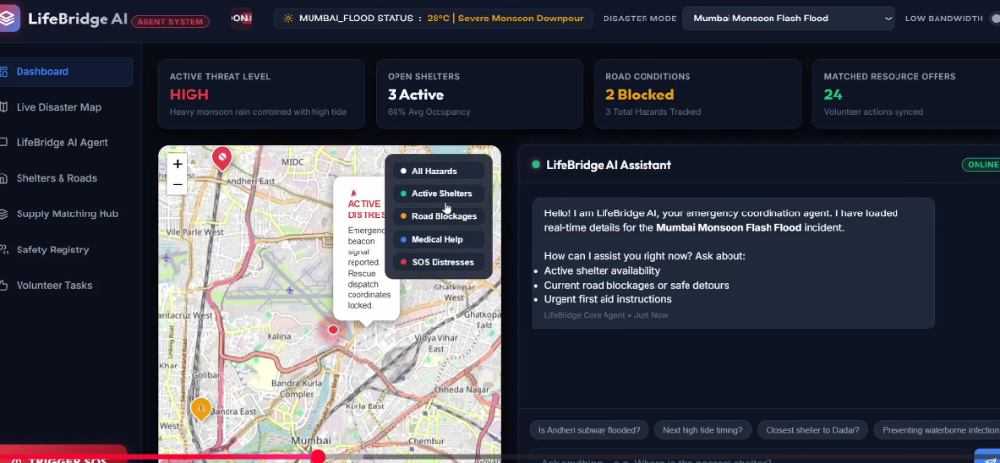

# 🌉 LifeBridge AI: Indian Disaster Response & Emergency Dashboard

**LifeBridge AI** is an advanced, highly accessible emergency coordination platform designed specifically for citizens, NGOs, and civil authorities in India. It assists in real-time response during severe crises such as monsoons, flash floods, and cyclones (e.g., in Mumbai, Chennai, Assam, and Odisha).

---

## 📸 Project Interface & Live Map

### 1. Main Dashboard & Emergency Hub
The dashboard provides citizens with instant triage resources, including quick-dial local helpline buttons, a bilingual Quick Start guide, real-time weather/tide alerts, and a text crisis survival kit builder.



### 2. Interactive Disaster Map with Inline Pin Labels
A custom vector-based live map displays real-time relief centers, blocked routes, and distress markers. It features smooth panning, button-based and slider-based zooming, pulsing warning circles around active flood zones, and inline glassmorphic status labels so users can find info instantly without needing to hover or click.



---

## 🌟 Key Features

### 1. 🗺️ High-Usability Interactive Map
* **Pan & Zoom Controls:** Easy dragging navigation and a custom vertical zoom slider for precise level changes.
* **Inline Labels:** Glassmorphic tags displaying pin titles and states (e.g., `[Open]`, `[Blocked]`, `[Camp]`) next to markers.
* **Danger Zone Overlays:** Visually highlights active hazard boundaries (e.g., Kurla, Velachery) with pulsing danger-red transparent overlays.
* **Low-Bandwidth Mode:** Toggle street maps off to load a dark vector blueprint grid, reducing network payload and saving device battery during severe outages.

### 2. 🗣️ Multilingual Support (11 Indian Languages)
Supports instant translation of the entire UI into:
* **English**, **Hindi (हिंदी)**, **Marathi (मराठी)**, **Tamil (தமிழ்)**, **Bengali (বাংলা)**, **Assamese (অસમীয়া)**, **Odia (ଓଡ଼ିଆ)**, **Telugu (తెలుగు)**, **Gujarati (ગુજરાતી)**, **Kannada (ಕನ್ನಡ)**, and **Malayalam (മലയാളം)**.
* **Regional Auto-Switching:** Selecting a disaster zone dynamically translates the UI to the local language of that region (e.g., selecting Mumbai sets it to Marathi, Chennai sets it to Tamil, Assam to Assamese, and Odisha to Odia).

### 3. 🛡️ Safety Registry & Privacy Search
* Citizens can register their current status (e.g., `Safe & Okay` vs `Stranded / Need Help`) with local landmarks and details.
* Registering as **Stranded** automatically broadcasts a red SOS marker onto the interactive live map for rescue teams.
* A privacy-first search registry masks mobile phone numbers (`98765*****`) to protect citizens' security.

### 4. 📦 Proximity Supply Matching Engine
* Connects resource needs (requests) with resource donations (offers) of items like water, food, and medicine.
* **Auto-Matching:** Automatically pairs requests and offers located in the same relief hub/camp, displaying an interactive donor-to-recipient logistics card with a "Confirm Delivery" button.

### 5. 🌊 Hydrological Hydrant alerts (High Tide Logs)
* Active tracking of tidal surge times, heights, and risk alerts (e.g., Brahmaputra gauge levels or Mumbai ocean tide limits) to preemptive evacuation warnings.

---

## ⚙️ Technical Architecture & Stack
* **Frontend Dashboard:** React 18, Vite, CSS3 (Glassmorphism, CSS Custom Variables, Keyframe Animations), Lucide Icons.
* **Backend API & Orchestration:** FastAPI, Python, Uvicorn, ADK (Agent Development Kit).
* **Map Layering:** Multi-layer HTML5 Canvas/SVG vector engine with base tile toggle.

---

## 🛠️ Local Installation & Setup

### Prerequisites
* **Node.js** (v18+)
* **Python** (v3.11+) and `uv` package manager

### 1. Run Backend Server
```bash
cd lifebridge-ai
uv run adk web app --host 127.0.0.1 --port 8080
```
*The API server will launch at `http://127.0.0.1:8080/`.*

### 2. Run Frontend Dashboard
```bash
cd frontend
npm install
npm run dev
```
*The React client will launch at `http://localhost:5173/`.*
