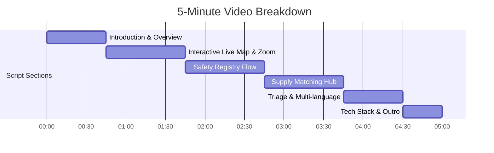

# 🎬 LifeBridge AI - 5-Minute Video Presentation Script

This script is structured for a 3-to-5 minute screen recording of the **LifeBridge AI** application. Follow the cues below to record a compelling walkthrough.

---

## ⏱️ Timeline & Script Outline

---

## 🎙️ Step-by-Step Script

### 1. Introduction & Overview (0:00 - 0:45)
* **Visual on Screen:** Main Dashboard view with the active Mumbai Monsoon header, threat stats, and quick dial buttons.
* **Speaker:** 
  > *"Hello everyone! Today, I’m presenting **LifeBridge AI**—an advanced, highly accessible disaster response dashboard engineered specifically for Indian communities during floods and cyclones. 
  > 
  > When extreme monsoon waterlogging hits Mumbai or cyclones land on the Odisha coast, communication networks and power grids collapse. LifeBridge AI bridges the gap between stranded citizens, NGOs, and civil defense rescue teams with high-contrast UI, low-bandwidth capabilities, and regional translations."*

### 2. Interactive Live Map & Usability (0:45 - 1:45)
* **Visual on Screen:** Click the **"Live Map"** tab. Show mouse dragging/panning. Adjust the vertical zoom range slider up and down. Point to the glowing red flood danger rings.
* **Speaker:** 
  > *"Let's head over to the live disaster map. Traditional digital maps are hard to read in a crisis. LifeBridge AI fixes this:
  > - First, we display **direct, inline status labels** next to each pin—showing open shelters, medical camps, or road blockages instantly without requiring mouse hover.
  > - Second, we have a custom **vertical zoom slider** and pan-dragging interface that makes navigating the coordinate grid extremely smooth.
  > - If you select Mumbai, you'll see glowing, pulsing **Danger Zones** over Kurla and BKC, warning users of high flood risk.
  > - In a power outage, clicking **Low Bandwidth Mode** disables heavy street map tiles and loads a lightweight, dark vector blueprint grid to save mobile battery and loading time."*

### 3. Safety Registry & Stranded SOS Beacon (1:45 - 2:45)
* **Visual on Screen:** Click **"Safety Registry"** tab. Show the list of registered users. Register a new user as **Stranded** (e.g. *Amit Patel, stranded near Kurla West*). Go back to the Map tab to show the new red SOS pin.
* **Speaker:** 
  > *"Next is the **Safety Registry**. Relatives can search for family members by name or phone, with privacy masking enabled to protect citizens' phone numbers.
  > 
  > Let's simulate a stranded citizen. We register a status as 'Stranded' and add their current coordinate/landmark. The moment we submit, LifeBridge AI's matching engine automatically places a new **live red SOS beacon** directly on the interactive map with a blinking distress label, signaling emergency rescue teams to prioritize this location."*

### 4. Supply Matching Hub & Engine (2:45 - 3:45)
* **Visual on Screen:** Click **"Supply Matching Hub"** tab. Scroll to the bottom to show the unmatched needs and offers. Create a matching need and show the visual card pairing them with a green "Confirm Delivered" flow.
* **Speaker:** 
  > *"Resource distribution is another major challenge. Our **Supply Matching Hub** manages donation inventory and relief requests.
  > 
  > LifeBridge AI runs an **automatic local matching engine**. When a shelter requests drinking water or dry rations, the system scans active donor offers in that exact vicinity. Once a match is found, it renders a visual donor-to-recipient logistics flow card, letting coordinators confirm when supplies are successfully delivered."*

### 5. Multi-language Regional Support (3:45 - 4:30)
* **Visual on Screen:** Click the top language dropdown and switch to Hindi, then Marathi. Go back to Dashboard, select the **Chennai Floods** zone, and show the UI auto-switching to Tamil.
* **Speaker:** 
  > *"Accessibility means communicating in local languages. LifeBridge AI supports **11 major Indian languages** including Hindi, Tamil, Marathi, Bengali, and Assamese.
  > 
  > When a user selects a disaster zone, the dashboard automatically suggests and translates the interface to the regional dialect of that zone. For example, selecting Chennai switches the UI to Tamil, and selecting Guwahati switches it to Assamese."*

### 6. Tech Stack & Outro (4:30 - 5:00)
* **Visual on Screen:** Show the root README file on the GitHub repository page ([github.com/theajay-ds/LIFEBRIDGE-AI](https://github.com/theajay-ds/LIFEBRIDGE-AI)).
* **Speaker:** 
  > *"Technically, the dashboard is built with a React 18 front-end and a high-performance FastAPI backend. The entire code, setup documentation, and workflow assets are uploaded and fully documented on GitHub.
  > 
  > LifeBridge AI is designed to save lives when every second counts. Thank you!"*
