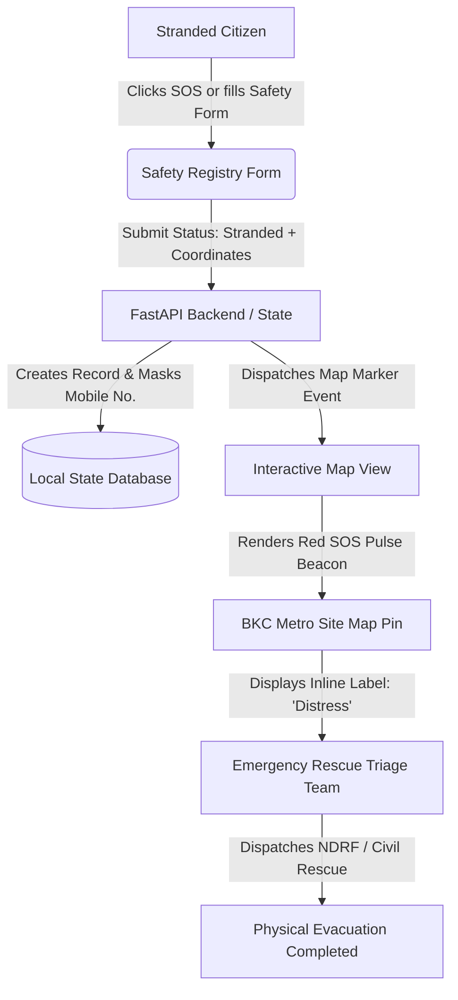
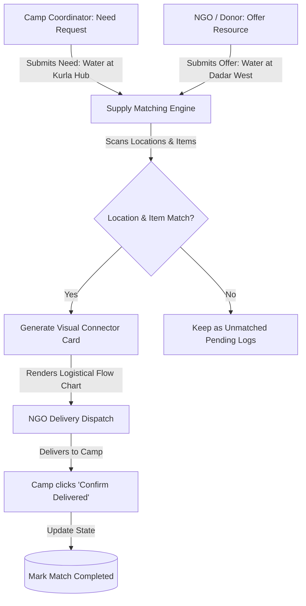

# 🌉 LifeBridge AI: Indian Disaster Response & Support Matching System

## 1. Project Overview & Problem Statement
During extreme weather events in India—such as the Mumbai monsoons, Chennai floods, Brahmaputra river overflows in Assam, or cyclones in coastal Odisha—emergency response faces critical bottlenecks:
1. **Severe Communication Outages & Battery Drain:** Heavy map data fails to load on low-bandwidth networks, and GPS tracking drains device batteries.
2. **Resource Mismatches:** Donors send supplies (food, water, medicine) to arbitrary areas, leaving critical relief camps undersupplied and causing logistics waste.
3. **Language Barriers:** National helplines and alert notifications are often not in the regional language of the affected citizens, leading to confusion during high-stress evacuations.
4. **Scattered Safety Tracking:** Families have no centralized, privacy-secure registry to look up if their loved ones are safe or stranded.

**LifeBridge AI** solves these challenges by combining a lightweight React-based disaster dashboard with a high-performance FastAPI backend. It features an interactive, low-bandwidth-friendly live map with direct status labels, a regional auto-translating language engine, a proximity-based supply matching pipeline, and a centralized safety search registry.

---

## 2. Core Functional Components

### A. Low-Bandwidth Interactive Map
* **Direct Pin Labeling:** Eliminates hover/click requirements by rendering semi-transparent status labels (e.g., `[Open]`, `[Blocked]`, `[Distress]`) next to markers.
* **Vertical Zoom Slider & Panning:** Intuitive sliding and drag pan movement for stressed users.
* **Flood Danger Zone Circle Overlays:** Glowing boundary highlights around active danger zones (e.g. Kurla, Velachery) indicating severe waterlogging or storm surges.
* **Tileless Grid Mode:** Toggles off external street maps, loading a dark vector blueprint grid that loads instantly over 2G/3G connections and conserves battery.

### B. Proximity Supply Matching Engine
* Allows users to input relief requests (Needs) and donations (Offers).
* **Auto-Pairing Pipeline:** Identifies matches by matching the requested item type and location, generating a visual logistics card that connects donor to camp with delivery confirmation actions.

### C. Safety Registry & Map SOS Integration
* Citizens report if they are `Safe & Okay` vs `Stranded / Need Help` along with coordinates/landmarks.
* **Dynamic Map Pinning:** Registering as "Stranded" automatically adds a new red SOS marker with flashing labels onto the live coordinator map.
* **Search Privacy:** Masks mobile numbers (`98765*****`) while allowing searches by name or phone.

### D. 11-Language Multilingual Translator
* Real-time UI localization for **English, Hindi, Marathi, Tamil, Bengali, Assamese, Odia, Telugu, Gujarati, Kannada, and Malayalam**.
* **Smart Regional Switch:** Auto-suggests and switches the dashboard language based on the selected active crisis zone.

---

## 3. Workflow & Flow Diagrams

### Diagram 1: Stranded Citizen & Emergency SOS Flow
This diagram illustrates how a stranded citizen reports their status, leading to a real-time database update and map marker dispatch.



### Diagram 2: Proximity Supply Matching Pipeline
This diagram shows how relief supplies (food, water, medical kits) are matched between donors and relief camps.



### Diagram 3: Auto-Language Context Transition
This diagram outlines how regional language suggestions trigger dynamic translation based on active crisis zones.

```mermaid
graph TD
    A[User Selects Zone] --> B{Selected Location?}
    B -->|Mumbai| C[Auto-suggest Language: Marathi]
    B -->|Chennai| D[Auto-suggest Language: Tamil]
    B -->|Guwahati| E[Auto-suggest Language: Assamese]
    B -->|Odisha| F[Auto-suggest Language: Odia]
    C --> G[Applies translation: TRANSLATIONS['mr']]
    D --> H[Applies translation: TRANSLATIONS['ta']]
    E --> I[Applies translation: TRANSLATIONS['as']]
    F --> J[Applies translation: TRANSLATIONS['or']]
    G & H & I & J --> K[Instant UI Localization Updates]
```

---

## 4. Technical Architecture
```
┌────────────────────────────────────────────────────────┐
│                   React 18 Frontend                    │
│      (Vite, Canvas Map Engine, Multilingual States)    │
└───────────────────────────┬────────────────────────────┘
                            │ REST APIs / HTTP
                            ▼
┌────────────────────────────────────────────────────────┐
│                   FastAPI Backend                      │
│             (Python, ADK Orchestration)                │
└───────────────────────────┬────────────────────────────┘
                            ▼
┌────────────────────────────────────────────────────────┐
│                 In-Memory Local DB / State             │
│            (Coordinates, Registry, Supplies)           │
└────────────────────────────────────────────────────────┘
```
